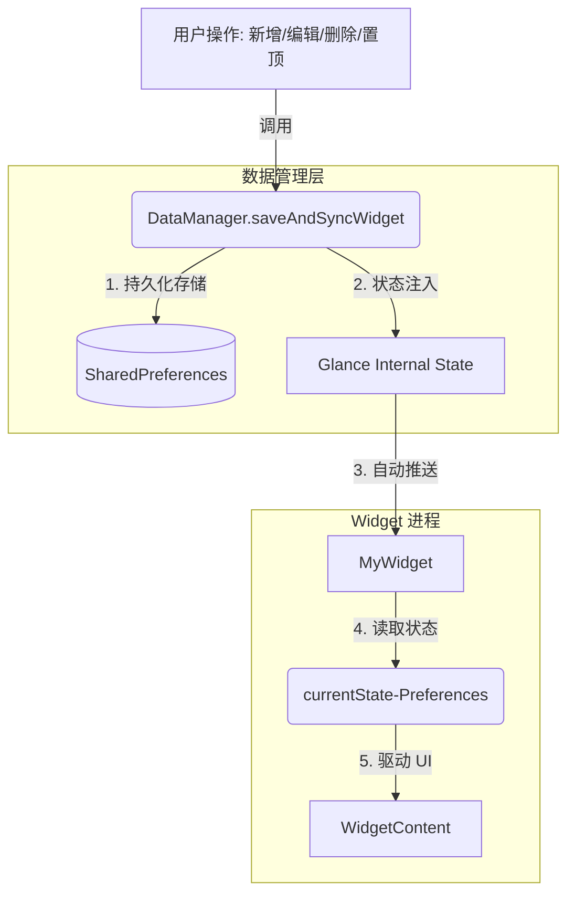

# 📱 Jetpack Glance Widget 架构与最佳实践指南

本指南总结了在开发“轻梅 Days”插件过程中沉淀的工程级方案，旨在解决 Widget 数据不同步、不刷新、0 到 1 显示异常等核心痛点。

## 1. 核心架构图 (The Architecture)

Widget 的本质是一个**跨进程的 UI 镜像**。必须遵循“单向数据流”原则，严禁 Widget 直接访问 App 的内部私有存储。



## 2. 黄金法则 (The Golden Rules)

### 🔴 绝对禁止 (Don'ts)

- **不要**在 Widget 内部读取 App 的数据库（Room）或 `SharedPreferences`。
  - *后果*：进程间 IO 竞争、数据延迟、UI 不同步。
- **不要**在 `provideGlance` 之外进行耗时的数据处理逻辑。
- **不要**定义全局的 `DataStore` 让 Widget 读。
  - *关键*：`currentState<Preferences>()` 只识别通过 `updateAppWidgetState` 写入的数据。

### 🟢 必须执行 (Do's)

- **必须**使用 `updateAppWidgetState` 注入数据：这是将数据从 App 进程传递到 Widget 状态的唯一标准通道。
- **必须**维护一个 `widget_version`：即使数据内容没变，自增版本号也能强制触发 Compose 重组。
- **必须**在数据注入完成后调用 `updateAll()`。

## 3. 核心代码模板

### A. 写入端：DataManager 同步逻辑

将数据“推”进 Glance 的状态机，而不是等 Widget 来“拉”。

```
// DataManager.kt
suspend fun saveAndSyncWidget(context: Context, events: List<LifeEvent>) {
    // 1. App 内部存储 (用于列表显示)
    saveToSharedPreferences(events)

    // 2. 准备 Widget 展示数据 (JSON)
    val displayEvent = events.find { it.isTop } ?: events.firstOrNull()
    val json = Gson().toJson(displayEvent)

    // 3. 核心：注入 Glance State
    val manager = GlanceAppWidgetManager(context)
    val glanceIds = manager.getGlanceIds(MyWidget::class.java)

    glanceIds.forEach { glanceId ->
        updateAppWidgetState(context, glanceId) { prefs ->
            prefs[WIDGET_EVENT_JSON] = json
            // 强制版本号自增，打破系统缓存
            val oldVer = prefs[WIDGET_VERSION_KEY] ?: 0
            prefs[WIDGET_VERSION_KEY] = oldVer + 1
        }
    }
    
    // 4. 唤醒刷新
    MyWidget().updateAll(context)
}
```

### B. 读取端：MyWidget 响应式读取

只读取 `currentState`，保持组件的纯净。

```
// MyWidget.kt
override suspend fun provideGlance(context: Context, id: GlanceId) {
    provideContent {
        val prefs = currentState<Preferences>()
        val version = prefs[DataManager.WIDGET_VERSION_KEY] ?: 0
        val json = prefs[DataManager.WIDGET_EVENT_JSON]

        val event = json?.let { Gson().fromJson(it, LifeEvent::class.java) }

        WidgetContent(event, version)
    }
}
```

### C. 强制刷新“保险丝”

在 UI 树中埋下一个依赖版本号的隐形节点。

```
@Composable
private fun WidgetContent(event: LifeEvent?, version: Int) {
    Column {
        // 隐形版本锚点：只要 version 变，整个 Column 必须重组
        Text(text = "$version", modifier = GlanceModifier.size(0.dp))
        
        if (event != null) {
            // 正常的业务 UI...
        } else {
            Text("点击添加日子")
        }
    }
}
```

## 4. 排查清单 (Troubleshooting)

| 现象                     | 可能原因               | 解决方案                                                     |
| ------------------------ | ---------------------- | ------------------------------------------------------------ |
| **新建 Widget 显示空白** | 状态未初始化           | 在 `WidgetContent` 中处理 `event == null` 的 UI 分支。       |
| **编辑后 Widget 不刷新** | 数据未写进 State       | 检查是否使用了 `updateAppWidgetState` 而非普通 IO。          |
| **置顶操作时好时坏**     | Compose 认为 UI 无变化 | 确认 `widget_version` 是否在每次操作时都进行了自增。         |
| **点击 Widget 没反应**   | Intent 参数丢失        | 确保 `actionStartActivity` 的 `ActionParameters` 已正确配置。 |

## 5. 总结

**App 操作是“源”，Glance State 是“桥”，Widget UI 是“影”。** 只要把“推”数据的逻辑写死在 `DataManager` 中，Widget 的稳定性将不再是玄学。